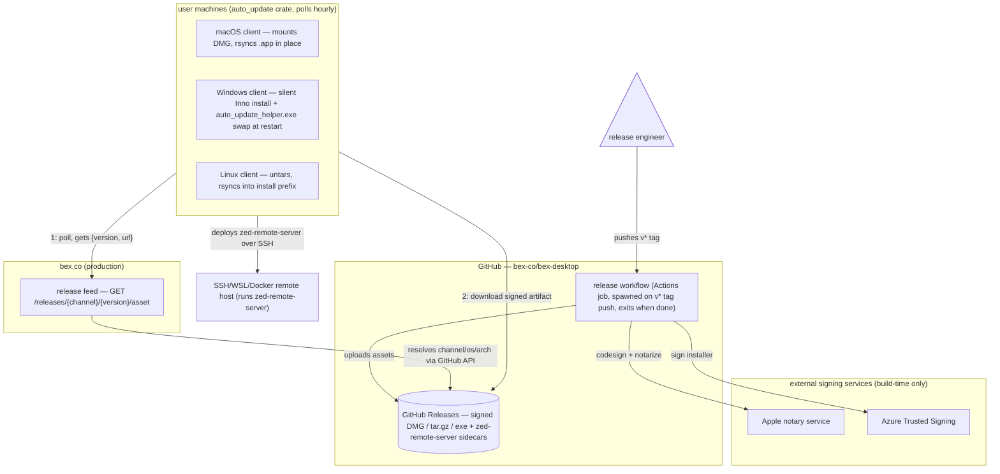

# ADR001: Auto-upgrade for bex-desktop

- **Status:** Proposed
- **Date:** 2026-09-04
- **Scope:** how bex-desktop builds, distributes, and self-updates its desktop app across macOS, Windows, and Linux

## Context

bex-desktop is a fork of [Zed](https://github.com/zed-industries/zed). Zed ships a complete self-update system, and the fork inherits all of its client-side machinery unmodified:

- The `auto_update` crate polls `{server_url}/releases/{channel}/latest/asset?asset=zed&os=…&arch=…` every 60 minutes and expects a JSON response `{ "version": …, "url": … }` (`crates/auto_update/src/auto_update.rs:670-731`). If `version` is semver-greater than the running build, it downloads `url` and installs it.
- The feed host derives from the `server_url` setting via a rewrite table (`crates/http_client/src/http_client.rs:306`). Only `zed.dev` is rewritten to `cloud.zed.dev`; any other host passes through verbatim. This fork already sets `server_url` to `https://bex.co` (`assets/settings/default.json`), so clients would query `https://bex.co/releases/…` — **the client side is already pointed at us.**
- Per-OS install: macOS mounts the DMG and rsyncs the `.app` over the running bundle; Linux extracts a tar.gz and rsyncs into the install prefix derived from the running binary path; Windows runs the Inno Setup installer silently and a separate `auto_update_helper.exe` swaps files at restart.
- The same feed serves `asset=zed-remote-server` sidecar binaries, which the client downloads and deploys over SSH/WSL/Docker for remote development.
- The updater performs **no checksum or signature verification** of downloads. Integrity rests on TLS to the feed and artifact hosts plus OS-level code signing (Developer ID + notarization on macOS, Authenticode on Windows) applied at build time.

What the fork is missing is the entire supply side:

1. `crates/zed/RELEASE_CHANNEL` contains `dev`, which disables update polling entirely (`crates/release_channel/src/lib.rs:201`) and forces `auto_update: false` in the settings profile.
2. Nothing serves `https://bex.co/releases/…`. Upstream's feed is `cloud.zed.dev`, a service we do not control and must not use.
3. Upstream's release automation is inert here: every workflow is guarded by `github.repository_owner == 'zed-industries'`, hardcodes the `zed-industries/zed` repo, Zed's runners, Zed's signing secrets, and a `cloud.zed.dev/releases/refresh` hook. The workflows are generated by `cargo xtask workflows`, so changes belong in the xtask source, not the YAML.
4. Two code paths bypass `server_url` and phone Zed directly: the WSL sandbox helper hardcodes `cloud.zed.dev` (`crates/sandbox/src/windows_wsl.rs:121`) and MCP OAuth client metadata hardcodes `zed.dev` (`crates/context_server/src/oauth.rs:37`).

## Decision

Keep Zed's client updater architecture, preserving Bex revision suffixes in version comparisons and URLs, and stand up a bex-owned supply chain behind the URL the client already queries. Three new pieces, smallest that can work:

1. **Artifact store: GitHub Releases on `bex-co/bex-desktop`.** A bex-owned release workflow (slim, xtask-generated, not upstream's) runs on `bex-v*` tag push, calls the existing `script/bundle-mac`, `script/bundle-linux`, and `script/bundle-windows.ps1` on GitHub-hosted runners, signs the artifacts, and uploads: per-arch DMGs, tar.gzs, Inno `.exe` installers, and `zed-remote-server-{os}-{arch}` sidecars.
2. **Release feed on bex.co.** A small service (edge worker or bex-api route) implementing Zed's feed contract:
   - `GET /releases/{channel}/{version|latest}/asset?asset={zed|zed-remote-server}&os={macos|linux|windows}&arch={aarch64|x86_64}` → `{ "version": "<semver>", "url": "<direct download URL>" }`
   - It resolves `latest` per channel by reading the GitHub Releases API and maps `asset`/`os`/`arch` to the matching release asset's download URL. It is the single point of trust for code execution on every client and is operated with production-security rigor (TLS only, no cache poisoning surface, audited writes).
3. **Channel and signing discipline.**
   - Ship a single `stable` channel first. Release builds set `ZED_RELEASE_CHANNEL=stable` (or carry a `stable` `RELEASE_CHANNEL` file on release branches, mirroring upstream's branch model). `dev` remains the default in-tree so working checkouts never self-update.
   - macOS artifacts are signed with a bex Apple Developer ID certificate and notarized. **The signing identity must be stable from the first public release**: macOS keychain access is bound to the signing identity, so an identity change mid-stream strands users' stored credentials after an in-place rsync update.
   - Windows installers are signed (Azure Trusted Signing or equivalent) to avoid SmartScreen. Linux tarballs are unsigned, matching upstream.
   - Versioning: retain upstream's complete `major.minor.patch` and append `-bex.N` for Bex revisions. Increment N for Bex-only releases and reset it to 1 when adopting a newer upstream version. Versions are strictly increasing and never re-tagged; the updater preserves the suffix and compares Bex versions using semver `>`.

### Parties

| Party                                        | Role                                                                                                                                     |
| -------------------------------------------- | ---------------------------------------------------------------------------------------------------------------------------------------- |
| Release engineer                             | Pushes the `v*` tag that cuts a release; holds no artifacts                                                                              |
| Release workflow (GitHub Actions)            | Ephemeral job: builds via `script/bundle-*`, signs, uploads; exits when done                                                             |
| Apple notary service / Azure Trusted Signing | External signing dependencies, contacted only at build time                                                                              |
| GitHub Releases (`bex-co/bex-desktop`)       | Durable artifact store; the `url` in every feed response points here                                                                     |
| bex.co release feed                          | Long-running service answering the client's poll with `{version, url}`                                                                   |
| macOS client                                 | Polls feed hourly; downloads DMG; rsyncs `.app` in place; relaunches                                                                     |
| Windows client + `auto_update_helper.exe`    | Polls feed; runs installer silently; helper swaps files at restart                                                                       |
| Linux client                                 | Polls feed; downloads tar.gz; rsyncs into its install prefix (self-update off for package-manager installs via `ZED_UPDATE_EXPLANATION`) |
| SSH/WSL/Docker remote host                   | Receives the `zed-remote-server` sidecar deployed by a client over SSH                                                                   |

### Architecture



Publishing flows down the left (engineer → workflow → signed assets on GitHub Releases); consumption flows up from user machines, which poll the bex.co feed for `{version, url}` and then pull the signed artifact straight from GitHub Releases.

### Required fork patches

These accompany (not precede) the first release:

- Point the WSL sandbox helper's hardcoded `cloud.zed.dev` URL at the bex feed (`crates/sandbox/src/windows_wsl.rs:121`).
- Point MCP OAuth client metadata away from `zed.dev/oauth/client-metadata.json` (`crates/context_server/src/oauth.rs:37`).
- Serve (or stub) the release-notes endpoints the updater UI links to: `{server_url}/releases/{channel}/{version}` and `/api/release_notes/v2/{channel}/{version}`.
- Optionally set `ZED_MINIDUMP_ENDPOINT` and `ZED_CLIENT_CHECKSUM_SEED` at build time; both default to off/absent, which is acceptable for v1.

## Consequences

**Positive.** Zero client-side diff means upstream merges stay cheap — the update engine, UI, and per-OS installers evolve with Zed and we inherit fixes for free. The feed is a thin stateless translator over GitHub Releases, so there is no artifact storage to operate. Users get hourly, silent, resumable-on-wake upgrades identical to Zed's UX.

**Negative / accepted risks.**

- The feed is a single point of compromise: the updater verifies nothing beyond TLS, so whoever controls `bex.co/releases/*` (or the GitHub org) can push arbitrary code to every client. This matches Zed's own trust model; we accept it and mitigate operationally (org 2FA, protected tags, least-privilege tokens, feed change review).
- Apple Developer Program and Windows signing subscriptions become hard release dependencies; an expired cert blocks shipping.
- No `preview`/`nightly` channels, no DigitalOcean-style nightly bucket, and no winget/brew automation in v1 — added later if needed; package-manager builds must bake in `ZED_UPDATE_EXPLANATION` to keep self-update off.
- GitHub Releases as the download origin means client downloads depend on GitHub availability.

## Alternatives considered

1. **No auto-update; distribute via package managers only.** Lowest effort, but macOS/Windows users of the direct download would silently stagnate, and security fixes (ours and upstream's) would not propagate. Rejected.
2. **Static JSON manifest (GitHub Pages) instead of a feed service.** The contract requires resolving four query dimensions (`channel`, `asset`, `os`, `arch`) plus `latest`, and updating a static file per release re-introduces a publish step that can drift from the actual release. A stateless worker reading the GitHub API is barely more code and cannot drift. Rejected.
3. **Clone Zed's full pipeline (preview/nightly trains, cherry-pick automation, blob store).** Built for a release cadence and team size we do not have; every extra workflow is merge-conflict surface against upstream. Rejected for v1; the branch-per-minor model is retained so `preview` can be added later without redesign.
4. **Replace the updater with Sparkle/Squirrel/MSIX or add our own signature verification.** Any client-side change is permanent fork diff against an actively evolving upstream crate, and OS-level signing already provides execution-time integrity on the two platforms that enforce it. Rejected; revisit only if we outgrow the trust model.

## Implementation and release operation

The website implementation is in the separate `bex-co/eden-cms-v2` repository.
It serves the asset feed, download redirects (including the WSL sandbox), release
notes JSON, browser redirects to GitHub release notes, and
`https://bex.co/oauth/client-metadata.json`. The GitHub repository and release
assets must remain public; the feed and desktop downloads require no GitHub token.

`cargo xtask workflows` generates `.github/workflows/bex_release.yml` from
`tooling/xtask/src/tasks/workflows/bex_release.rs`. The workflow runs on `bex-v*` tag
pushes in `bex-co/bex-desktop`; a manual dispatch must select an existing release
tag. Changes to the pipeline on main run its tests and verify generated workflow
files without building or publishing a release. `script/bex-release.py` validates and publishes releases. The workflow:

1. Requires `bex-v<major>.<minor>.<patch>-bex.<revision>` to match `crates/zed/Cargo.toml`, point at
   the checked-out commit, and belong to main's history. It refuses an already
   published tag or a version older than any published stable release.
2. Checks all signing configuration before starting the six builds.
3. Builds macOS and Linux natively for each architecture, and cross-compiles both
   Windows targets on Windows Server 2022. Release jobs set `RELEASE_CHANNEL` to
   `stable` in the checkout; main's checked-in channel remains `dev`.
4. Signs and notarizes macOS DMGs using bex's Developer ID, signs Windows binaries
   and installers using Azure Trusted Signing, and collects two artifacts per
   platform. The Windows toolchain is discovered with `vswhere` so GitHub's
   Enterprise installation works as well as a local Community installation.
5. Requires all 12 installer/sidecar artifacts, writes `SHA256SUMS`, uploads into
   a draft release, checks uploaded names and sizes, then publishes it as latest.
   A failed upload leaves a draft that can be retried; published assets are never
   intentionally replaced. Release runs are serialized to prevent competing
   versions from advancing the stable feed out of order.

Versions retain the complete upstream Zed version and append `-bex.N`, starting
at 1. Increment N for Bex-only releases; reset it to 1 when adopting a newer
upstream version. The current baseline is Zed `1.20.0` at
`b1a7ef0cf66dfbf9d7661170c96d97c7df916c68`, recorded in
`package.metadata.bex-upstream` in `crates/zed/Cargo.toml`. Validation checks the
baseline's ancestry and crate version; generated release notes name that baseline.
A merge that changes the upstream version must update both the metadata and the
Bex crate version.

`-bex.N` denotes a stable Bex revision even though SemVer parses it as a prerelease.
GitHub releases remain `prerelease=false`; the stable updater retains the suffix
in comparisons and URLs. For example, `1.20.0-bex.10` follows `1.20.0-bex.2`, and
`1.20.1-bex.1` follows both. Plain upstream releases cannot replace a Bex install.
The feed accepts only Bex versions and resolves them to `bex-v` tags. No plain
`v1.20.0` release was published, so no public legacy-version migration is needed.

Native package fields use numeric versions: Windows uses `major.minor.patch.N`
for AppX and installer version resources. macOS uses `N` for CFBundleVersion and
the upstream `major.minor.patch` for
CFBundleShortVersionString. The macOS build number resets with a new upstream
marketing version; the desktop updater compares the full application version.
The application and feed retain the full `-bex.N` version. Release validation caps
N at 9999 and base components at 65535 to keep Windows fields representable and
the macOS build number within four digits.

Configure these repository **secrets** before the first release:

- `MACOS_CERTIFICATE`: base64-encoded Developer ID Application `.p12`.
- `MACOS_CERTIFICATE_PASSWORD`: password for that `.p12`.
- `APPLE_NOTARIZATION_KEY`: App Store Connect API private key text.
- `APPLE_NOTARIZATION_KEY_ID` and `APPLE_NOTARIZATION_ISSUER_ID`.
- `AZURE_SIGNING_TENANT_ID`, `AZURE_SIGNING_CLIENT_ID`, and
  `AZURE_SIGNING_CLIENT_SECRET`: an identity authorized to sign with the bex
  Azure signing certificate profile.

Configure these repository **variables**:

- `MACOS_SIGNING_IDENTITY`: full bex Developer ID Application identity from the
  certificate. Keep this identity stable across releases. The upstream Zed
  provisioning profile is omitted when using a custom signing identity; the
  current entitlements require no provisioning profile.
- `AZURE_SIGNING_ACCOUNT_NAME`, `AZURE_SIGNING_CERT_PROFILE_NAME`, and
  `AZURE_SIGNING_ENDPOINT`.
- `WINDOWS_SIGNING_PUBLISHER`: the exact certificate subject distinguished name
  used by Azure signing. It is written into the AppX manifest, whose package name
  is `BexCo.BexDesktop`, so the explorer extension can be signed and removed
  independently of upstream Zed.

After merging the intended changes to main, update the crate version for a new
release, commit and push that change, then push the matching tag. For example,
when the committed crate version is `1.20.0-bex.1`:

```sh
git tag bex-v1.20.0-bex.1
git push origin bex-v1.20.0-bex.1
```

Protect release tags against deletion and updates, and restrict their creation to
release maintainers. Do not retag a failed release to different source: fix the
problem on main and use a newer version. For a transient build/upload failure,
rerun the workflow for the same unchanged tag while its release is still a draft.

Validate pipeline changes with:

```sh
python3.12 -m unittest discover -s script -p test_bex_release.py
cargo xtask workflows
cargo xtask check-workflows
./script/clippy -p xtask
```

The first signed release still needs a full platform build and installation/
self-update smoke test. Workflow generation and publication tests do not prove
that external signing credentials or the resulting native installers work.
